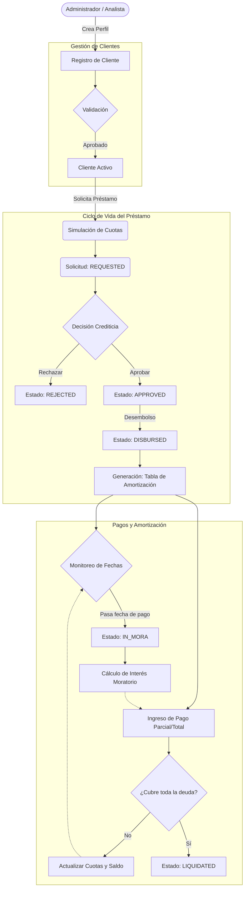

# Flujo del Sistema de Gestión de Préstamos

A continuación se detalla el ciclo de vida principal (Core Lifecycle) y el flujo de los datos dentro del sistema, desde la creación de un cliente hasta la liquidación del préstamo.

## Diagrama de Flujo Principal

## Fases del Proceso:

1. **Gestión de Clientes:** Todo proceso comienza cuando un miembro del personal registra un nuevo cliente verificando su Buró de Crédito y estableciendo su Límite Crediticio.
2. **Ciclo del Préstamo:** Se puede utilizar un endpoint de simulación para ver cómo quedarán las cuotas mensuales (usando la fórmula de amortización francesa). Una vez se está conforme, el préstamo pasa a estado **REQUESTED**. Un Analista lo evalúa y puede cambiar su estado a **APPROVED** o **REJECTED**.
3. **Desembolso:** Cuando se entrega el dinero físico/transferencia al cliente, el préstamo se marca como **DISBURSED**. En este instante la Base de Datos automáticamente genera las cuotas con sus fechas de vencimiento.
4. **Cobros y Liquidación:** A partir del desembolso, el sistema espera recibir pagos a través del registro en caja. Cada pago descuenta en orden de prioridad: *Intereses de Mora, Intereses Ordinarios y finalmente el Capital principal*. Si se vence el tiempo, el estado del préstamo cambia a **IN_MORA**. Cuando todo el capital se cancela, pasa exitosamente a **LIQUIDATED**.
